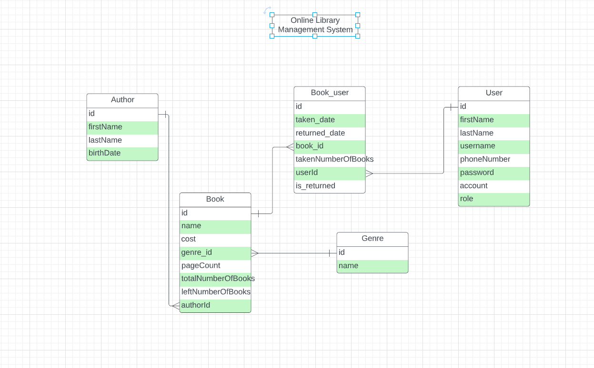
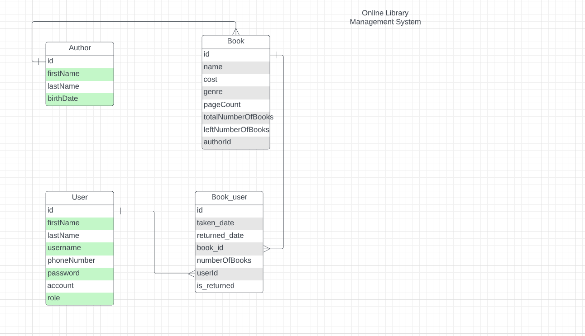
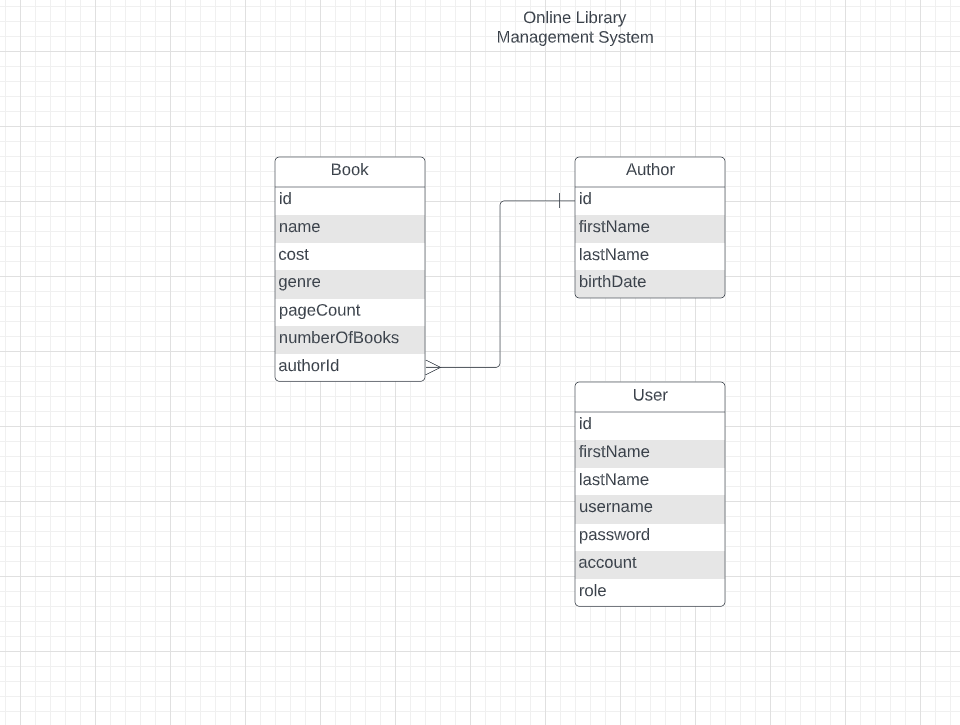

"# online-library-management"

-- Online Library Management system --
For managing and automation Library management
For both users and administrators of library
Administrators - Can manage Books, Genres, Authors, Users 
Admin - Can borrow and take books to/from Users(Automated)
Users - Can see which books they have taken from library
Functionalities - Without any registration or logging in all users(Admin, Users)
can see all available books (with searching)

Used Technologies
Java 11, Servlet(JSP, JSTL) JDBC, PostgresSQL, GitGub
For creating database tables and constraints data.sql file is provided in resources directory 

Entity structure 2.1.0
https://lucid.app/lucidchart/519b32cf-cd87-4870-a58d-e3297b19a622/edit?beaconFlowId=0E2FCF402080794F&invitationId=inv_474a8854-1425-4d8a-806e-2936229f9947&page=0_0#

Entity structure 1.2.0
https://lucid.app/lucidchart/519b32cf-cd87-4870-a58d-e3297b19a622/edit?beaconFlowId=0E2FCF402080794F&invitationId=inv_474a8854-1425-4d8a-806e-2936229f9947&page=0_0#

Book_user relation is added 

Entity structure version 1.1.0
https://lucid.app/lucidchart/519b32cf-cd87-4870-a58d-e3297b19a622/edit?beaconFlowId=0E2FCF402080794F&page=0_0&invitationId=inv_474a8854-1425-4d8a-806e-2936229f9947#

 